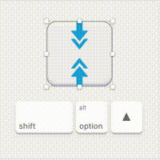

# Nudge Resize Sketch Plugin
 

Sketch Plugin to quickly resize the width and height of a layer through easy keyboard shortcuts.

Similar to holding 'alt' whilst resizing with the mouse; 'Nudge Resize' works the same.

## Usage

<kbd>⌥ alt</kbd> + <kbd>→</kbd> = Expand layer size horizontally

<kbd>⌥ alt</kbd> + <kbd>←</kbd> = Condense layer size horizontally

<kbd>⌥ alt</kbd> + <kbd>↓</kbd> = Expand layer size vertically

<kbd>⌥ alt</kbd> + <kbd>↑</kbd> = Condense layer size vertically

**Note: Add <kbd>⇧ Shift</kbd> to increase the nudge size**

The amount the layer resizes by is based on the user's nudge size:

- default = 1
- default large (shift) = 10

This means that if you change your settings with [nudg.it](http://nudg.it), it will respect this preference.

## Why make this plugin?

Currently, you can resize a layer by using 'cmd + arrow' or 'cmd + shift + arrow', but that resizes with a fixed top, and a fixed left side — what about resizing from the centre of the layer. I would often resize a layer with these commands, then move the layer to try and re-centre the layer where it was. This plugin/script is a real time saver — I use it every day without fail.

## Installation

1. [Download](https://github.com/DWilliames/nudge-resize-sketch-plugin/releases/download/v1.0/Nudge.Resize.sketchplugin.zip) the plugin
2. Double-click the file, 'Nudge Resize.sketchplugin'
3. That's it...

## Contribute

This plugin is in active development.

Pull requests are welcome and please submit bugs 🐛.

## Contact

* Follow [@davidwilliames](https://twitter.com/davidwilliames) on Twitter
* Email <david@williames.com>

---

If you find this plugin helpful, consider shouting me coffee ☕️ via [PayPal](https://www.paypal.me/dtw/5)

